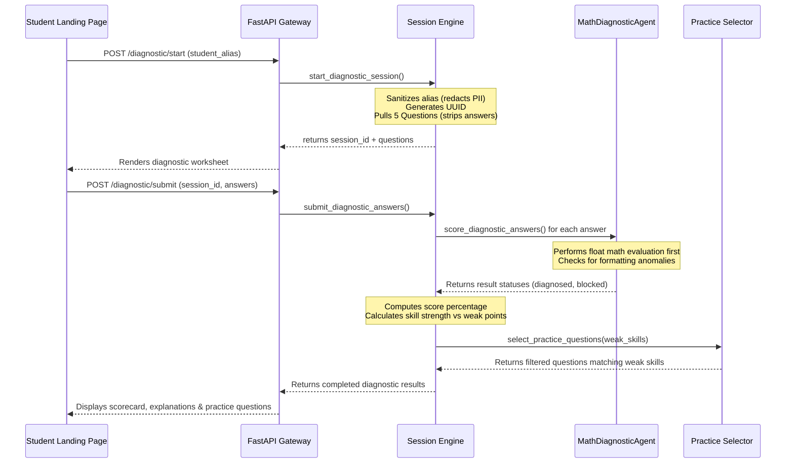

# ExamReady Zen Math MVP Step 2 Completion Report: Diagnostic Session Engine

## What Was Added
- **Diagnostic Session Manager (`app/session.py`):** Handles session initialization (start endpoint) and submission logic, generating secure session UUIDs and redacting any user PII (like emails) during registration.
- **Grading & Aggregator (`app/scoring.py`):** Scores incoming questions against expected answers. Uses the safety-screened `diagnose_math_answer()` function to classify precision and formatting errors vs. conceptual failures.
- **Remediation Router (`app/practice_selector.py`):** Recommends practice questions matching weak skills from the demo question bank. Falls back to a mixed review of questions if the student has no weak skills.
- **FastAPI Endpoints (`app/health_api.py`):** Exposes `POST /diagnostic/start` and `POST /diagnostic/submit`.
- **Integration Test Suite (`tests/test_diagnostic_session.py`):** Evaluates end-to-end sessions, scoring precision cases, classification thresholds, and validation of PII blocks.

---

## 🔄 Diagnostic Session Flow

The diagnostic flow follows a clean, decoupled path:

---

## 📊 Scoring & Weak Skill Detection Logic

- **Evaluation:** Questions are scored individually. If a student answer matches the expected value numerically (e.g. `35.1` matches `35.10`), the answer is graded as correct and flagged with a `formatting precision issue`.
- **Threshold Rule:** Correct responses are compiled per skill category (e.g., `decimal_subtraction`).
    *   **Weak Skill:** Any skill category with a score **strictly below 70%** (e.g., scoring $0/1$ or $1/2$ correct).
    *   **Strength:** Any skill category with a score **equal to or greater than 70%**.

---

## 🎯 Practice Recommendation Engine

The recommendation engine strictly follows local-first design criteria:
*   Queries the `demo_math_questions.json` question bank for questions matching identified `weak_skills`.
*   If no weak skills are identified (e.g., the student scored $100\%$), it compiles a **mixed review** of questions from the bank.
*   The recommended questions include expected answers and step-by-step correction instructions to enable immediate student review.

---

## 🎓 Application of 5-Day AI Agents Course Lessons

*   **Day 1 (Project Layout):** Keeps everything encapsulated in the isolated `examready-zen-api` folder, using Makefile commands for repeatable validation.
*   **Day 2 (Deterministic Correction First):** Relies on float-based numerical parsing before string evaluation. This ensures exact grading calculations without introducing costly LLM latency or grading hallucinations.
*   **Day 3 (Golden Test Assurance):** Tests the end-to-end flow using the golden precision subtraction case (`47.55 - 12.45 = 35.1`), asserting that the session engine correctly labels the mastery as `correct`.
*   **Day 4 (PII and Safety Screen):** Runs `redact_pii` on the `student_alias` parameter during session startup, preventing raw email formats or other potential personal identifier leaks from being persisted in the session storage.
*   **Day 5b (Readiness Verification):** The readiness checks evaluate that all new imports (`session`, `scoring`, `practice_selector`) are clean and run the golden diagnostic check on boot.

---

## ➡️ Next Step
Connect the landing page "Start Math Diagnostic" button in the frontend to call the `POST /diagnostic/start` endpoint, and wire the submit button to post results to `POST /diagnostic/submit`.
