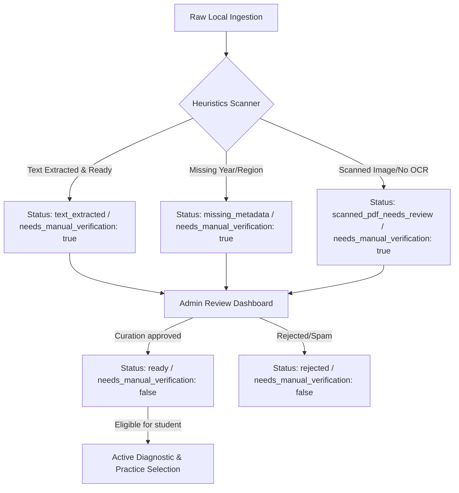

# ExamReady Zen — Step 12: Manual Review & Approval Workflow Report

This report summarizes the design, endpoints, status lifecycles, and usage instructions for the newly implemented Exam Bank Manual Review and Approval Workflow.

---

## 1. Why Manual Review is Required

 Morocan regional exams are ingested from diverse sources (user-provided local folders containing scanned PDFs, ZIP archives, or OCR drafts). Due to variations in document quality, scanning noise, and formatting, automated ingestion cannot guarantee 100% precision out-of-the-box.
*   **Safety Assurance**: Prevent uncurated, incorrect, or corrupted questions from being served to students in active diagnostics or practice modules.
*   **Formatting/OCR Correction**: Allows local administrators/teachers to review raw questions, verify topic assignments, detect missing expected answers, and ensure math symbol rendering looks correct.
*   **Copyright & Curation Quality Control**: Acts as a human-in-the-loop validation gate prior to system-wide curriculum deployment.

---

## 2. Ingestion & Status Lifecycle

### Registered Statuses:
1.  **`imported_draft`**: Default draft status for basic imports.
2.  **`needs_manual_review`**: Ingestion completed but flags are set for human double-checks.
3.  **`scanned_pdf_needs_review`**: Raw scan PDF detected with character counts <= 100, requiring manual re-transcription.
4.  **`missing_metadata`**: Ingestion succeeded but metadata fields like year or region are unknown.
5.  **`ready`**: Curation approved. Eligible to be served to students in diagnostics, practice, and topic coverages.
6.  **`rejected`**: Deemed invalid or corrupt. Remains registered in the administration index but excluded from student features.

---

## 3. Backend REST APIs

1.  **`GET /exam-bank/{exam_id}`**:
    *   **Description**: Retrieves registry details, source filename, topic sets, parsed questions list, and extraction warnings.
    *   **Warning Indicators**: Highlights scanned PDFs, missing metadata, missing question extraction structures, or missing expected answer keys.
2.  **`PATCH /exam-bank/{exam_id}/review`**:
    *   **Description**: Receives approval status updates, markdown review notes, and admin tags. Enforces status boundaries, writes to registry, and timestamps `updated_at`.

---

## 4. Frontend Views & Helpers

*   **`lib/examreadyZenApi.ts`**:
    *   `getExamBankExam(examId)`: Queries detailed exam structures.
    *   `reviewExam(examId, payload)`: Posts curation review states.
*   **`app/examready-zen/exam-bank/page.tsx`**:
    *   Added a prominent safety warning alert explaining review validation requirements.
    *   Appended a `"Réviser ⚙️"` column link in the main exams registry table.
*   **`app/examready-zen/exam-bank/[examId]/page.tsx`**:
    *   Created the **"Révision de l’examen"** workspace.
    *   Includes ingestion metadata cards, extraction alerts lists, topic sets, question drawers, and the review form containing notes textarea and approval selectors.

---

## 5. Verification & Testing

### Automated Tests
1.  **Pytest**: Created `tests/test_exam_review_workflow.py` validating:
    *   Retrieve exam detail payload shapes.
    *   Post updates to registry status.
    *   Validate allowed status sets.
    *   Exclude non-ready drafts and rejected documents from student diagnostic session flows.
    *   List approved `ready` exams.
2.  **Readiness Checks**: Liveness gateways confirm overall status is `"ready"`, bypassing unreviewed documents.

### Manual Verification Instructions
1.  Start the FastAPI backend (`make serve` on port `8030`).
2.  Start the Next.js frontend (`npm run dev` on port `3000`).
3.  Access the admin bank: `http://localhost:3000/examready-zen/exam-bank`.
4.  Identify an unapproved exam (e.g. `math_anfa_unknown_year`) and click **Réviser ⚙️**.
5.  Inspect warnings and draft questions. Select **ready (Approuvé pour les élèves ✅)**, write review notes, and click **Enregistrer la révision**.
6.  Return to the diagnostic page at `http://localhost:3000/examready-zen/math-diagnostic` and confirm the approved exam is now an available source.

---

## 6. Next Step Recommendation

*   **OCR Correction Text Area Workspace**: Integrate a text editing form allowing reviews to modify parsed question contents, update topic identifiers, and insert expected answers directly on the exam review page before approving it to a `"ready"` status.
